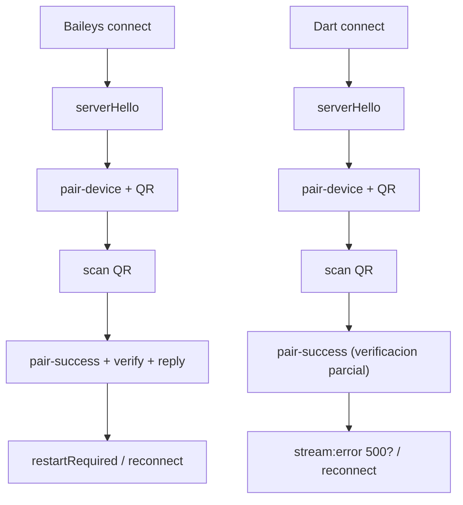

# Auditoria Baileys vs Dart (WhatsApp) - Diferencias y Plan de Cambios

## Referencia de versiones

- Baileys: commit `d0779026958ca607e4efd4abef8ba89d581e7027` (version `[2,3000,1035194821]`).
  - Fuente: `baileys-upstream/src/Defaults/baileys-version.json` y `baileys-upstream/src/Defaults/index.ts`.
- Dart (FlutterClaw):
  - `lib/whatsapp/socket/wa_socket.dart` usa `_waVersion = [2, 3000, 1035194821]`.

## Mapeo de modulos equivalentes

- Baileys `src/Socket/socket.ts` -> Dart `lib/whatsapp/socket/wa_socket.dart` + `lib/whatsapp/baileys.dart`.
- Baileys `src/Utils/validate-connection.ts` -> Dart `_buildClientPayload()` en `wa_socket.dart` y `configureSuccessfulPairingDart()` en `pair_success.dart`.
- Baileys `src/Utils/auth-utils.ts` (`initAuthCreds`) -> Dart `AuthenticationCreds.generate()` en `auth_state.dart`.
- Baileys handlers `pair-device` y `pair-success` en `socket.ts` -> Dart `QRAuth` y `pair_success.dart`.

## Diferencias criticas (riesgo directo de `stream:error 500`)

1) **Verificacion de `pair-success` incompleta**
   - Baileys:
     - Verifica `accountSignature` con `Curve.verify` usando `WA_ADV_ACCOUNT_SIG_PREFIX` o `WA_ADV_HOSTED_ACCOUNT_SIG_PREFIX`.
     - Usa `encodeSignedDeviceIdentity(account, false)` para el reply.
     - Actualiza `creds.account`, `creds.signalIdentities` y `me.lid`.
   - Dart:
     - Solo valida HMAC (`ADVSignedDeviceIdentityHMAC`) y firma del dispositivo.
     - No valida `accountSignature`.
     - No actualiza `account`, `signalIdentities` ni `me.lid`.
   - Impacto probable: pairing aceptado localmente pero rechazo del servidor en la reconexion.

2) **Login payload incompleto**
   - Baileys `generateLoginNode` incluye `username`, `device` y `lidDbMigrated=false`.
   - Dart `_buildClientPayload()` no setea `username`, `device` ni `lidDbMigrated`.
   - Impacto probable: login incompleto o inconsistente tras pairing.

3) **`registrationId` fuera de rango**
   - Baileys: `generateRegistrationId()` devuelve 14-bit (`UInt16 & 0x3FFF`).
   - Dart: `_generateRegistrationId()` genera 22-bit (`0x3fffff`).
   - Impacto posible: rechazo de registros o inconsistencias criptograficas.

4) **Estructura de `AuthenticationCreds` insuficiente**
   - Baileys `initAuthCreds` incluye contadores de pre-keys, `pairingEphemeralKeyPair`,
     `processedHistoryMessages`, `accountSettings`, `routingInfo`, etc.
   - Dart carece de estos campos, por lo que el estado posterior al pairing no
     replica el shape que Baileys espera.
   - Impacto probable: drift de estado y errores de sesion tras el QR.

## Diferencias no criticas (pero relevantes)

- `webInfo.webSubPlatform`:
  - Baileys cambia a `DARWIN` o `WIN32` cuando `syncFullHistory` esta activo y el
    browser es Desktop. Dart siempre envia `WEB_BROWSER`.
- `countryCode`:
  - Baileys toma `config.countryCode`; Dart siempre envia `US`.
- `deviceProps.requireFullSync`:
  - Baileys usa `config.syncFullHistory`; Dart fija `false`.
- `historySyncConfig`:
  - Dart no incluye varios campos opcionales que Baileys rellena como `undefined`.
- QR rotation y expiracion:
  - Baileys: primer QR 60s, siguientes 20s, y termina si se acaban refs.
  - Dart: siempre 20s y si se acaban refs solo deja de emitir.

## Recomendaciones de cambio (patch plan)

1) **Payload de login**
   - Archivo: `lib/whatsapp/socket/wa_socket.dart`.
   - Incluir `username`, `device` y `lidDbMigrated=false` cuando `creds.me` exista.
   - Tomar `countryCode` de configuracion (agregar a `WASocketConfig`).
   - Ajustar `webSubPlatform` con la misma regla que Baileys (DARWIN/WIN32 si `syncFullHistory`).

2) **`AuthenticationCreds` alineado con Baileys**
   - Archivo: `lib/whatsapp/auth/auth_state.dart`.
   - Agregar campos:
     - `pairingEphemeralKeyPair`
     - `processedHistoryMessages`
     - `nextPreKeyId`, `firstUnuploadedPreKeyId`
     - `accountSyncCounter`, `accountSettings`
     - `registered`, `pairingCode`, `lastPropHash`, `routingInfo`, `additionalData`
   - Cambiar `registrationId` a 14-bit para igualar Baileys.
   - Decidir formato interno de `advSecretKey` (recomendado: guardar base64 string y
     exponer bytes decodificados cuando haga falta).

3) **`pair-success` con verificacion completa**
   - Archivo: `lib/whatsapp/auth/pair_success.dart`.
   - Verificar `accountSignature` usando `WA_ADV_ACCOUNT_SIG_PREFIX` y variante hosted.
   - Aplicar `encodeSignedDeviceIdentity(..., false)` equivalente (sin `accountSignatureKey`).
   - Actualizar `creds.account`, `creds.signalIdentities` y `me.lid`.
   - Asegurar uso de `WA_ADV_HOSTED_DEVICE_SIG_PREFIX` cuando aplique.

4) **QR flow**
   - Archivo: `lib/whatsapp/auth/qr_auth.dart`.
   - Implementar QR TTL: primer QR 60s, siguientes 20s.
   - Si no hay mas `ref`, terminar la conexion con error `timedOut` (como Baileys).

5) **Stream error handling**
   - Archivo: `lib/whatsapp/socket/wa_socket.dart`.
   - Parsear el `reason` desde el child tag (Baileys `getErrorCodeFromStreamError`).
   - Mapear `restartRequired` y `badSession` correctamente.
   - Ajustar politica de reset vs rotate noise key para que coincida con Baileys.

## Diagrama Mermaid (flujo comparativo)

## Test plan propuesto

1) Manual: pairing QR nuevo -> sin `stream:error 500` y reconexion limpia.
2) Manual: relogin con `creds.me` -> payload incluye `username` y `device`.
3) Manual: QR rotation respeta 60s/20s y timeout cuando se agotan refs.
4) Unit: `registrationId` se mantiene en rango 14-bit.
5) Unit: verificacion `pair-success` falla si firma no valida.
